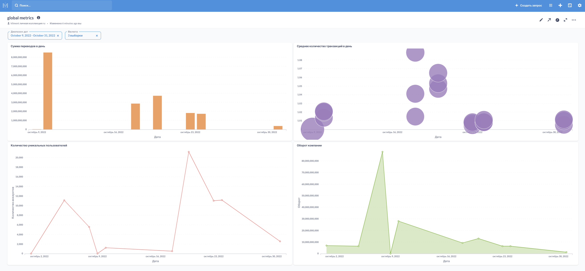

# Итоговый проект

## Подготовка

### Необходимо добавить переменные для подключения S3:

- AWS_ACCESS_KEY_ID
- AWS_SECRET_ACCESS_KEY

### Необходимо добавить подключение к Vertica в Connections

## Даг для получение данных из S3 [fill_stg.py](./src/dags/fill_stg.py)

- Получает данные по истории изменения валют
- Получает батчами данные по транзакциям

## Даг для заполнения итоговой витрины [fill_dwh.py](./src/dags/fill_dwh.py)

Подневно заполняет витрину за вчерашний день

## Итоговая витрина [create_dwh_global_metrics.sql](./src/sql/create_dwh_global_metrics.sql)

## Визуализация метрик в Metabase

